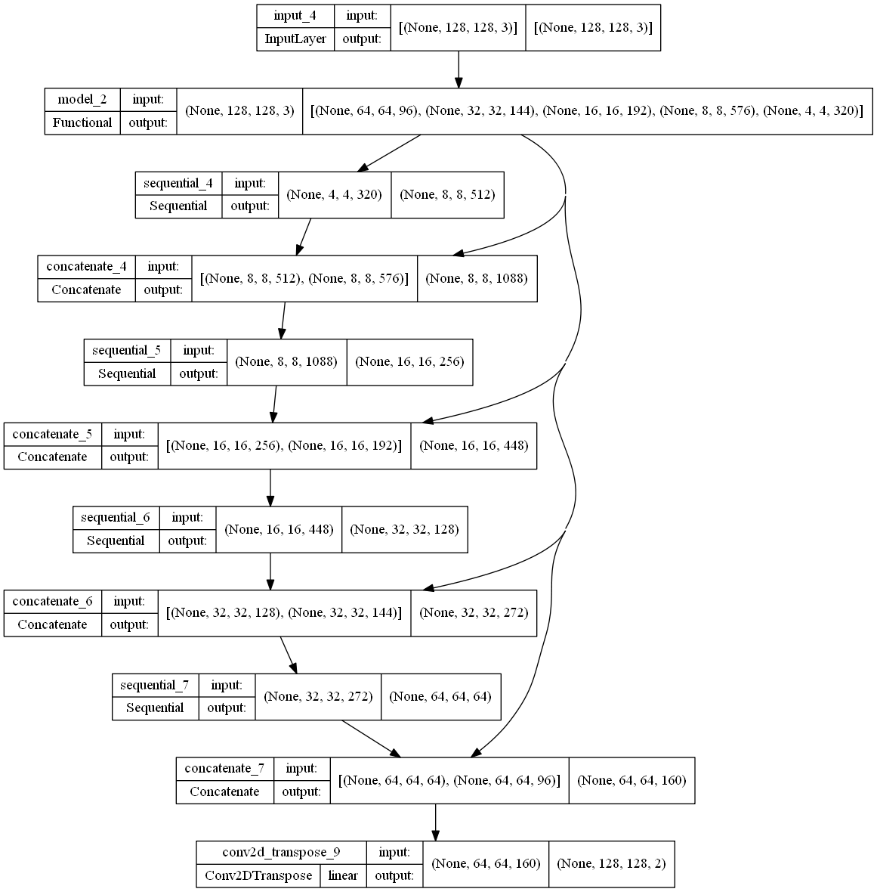

# 2018 Data Science Bowl - Detecting Cell Neuclei using U-Net Semantic Segmentation

## 1. Summary
2018 Data Science bowl challenge to identify cell nuclei in images for medical research

## 2. Code and Resources Used
*	This project is created using Google Colab as the main IDE. 
*	Main Packages: TensorFlow, Numpy, Matplotlib, OpenCV and Scikit-learn. 
*	This dataset has been taken from Kaggle. 
Kaggle link: https://www.kaggle.com/c/data-science-bowl-2018

## 3. Methodology
This project's methodology is based on documentation found on the official TensorFlow website. 
You can refer to it [here](https://www.tensorflow.org/tutorials/images/segmentation).

### 3.1. Data Pipeline
There are dataset files that contain train and test folders for training data and testing data respectively. 
The inputs will be in the format of images and image masks for labels. Feature scaling is applied to the input images before being used. 
The labels have been preprocessed to have binary values of 0 and 1 in them.  For this dataset, no data augmentation is used. 
Train data is split into 80:20 train-validation sets.

### 3.2. Model Pipeline
U-Net is the model architecture used in this project. 
For further information, read the TensorFlow documentation. 
In summary, the model is made up of two parts: a downward stack that acts as a feature extractor, and an upward stack that supports in the creation of pixel-wise output. 
The structure of the model is shown in the diagram below.

The model is trained with a batch size of 25 and for 10 epochs. Early stopping is also applied in the model training. 
The training accuracy achieved 96% and the validation accuracy of 93%. The two figures below show the graph of the training process.

 

## 4. Results
Upon evaluating the model with test data, the model obtains the following test results, as shown in the figure below.

The model also makes certain predictions based on some of the test data. Figures following show the actual output masks and predicted masks.
